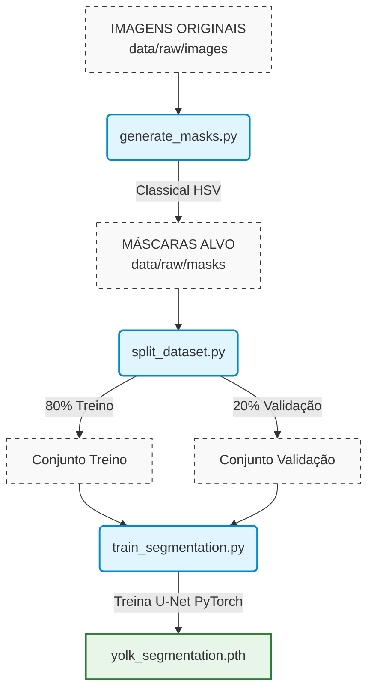
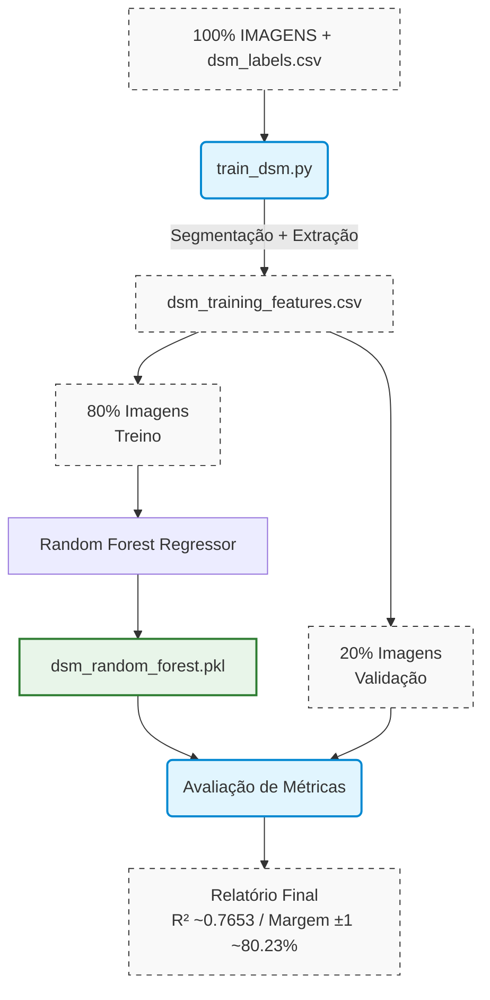
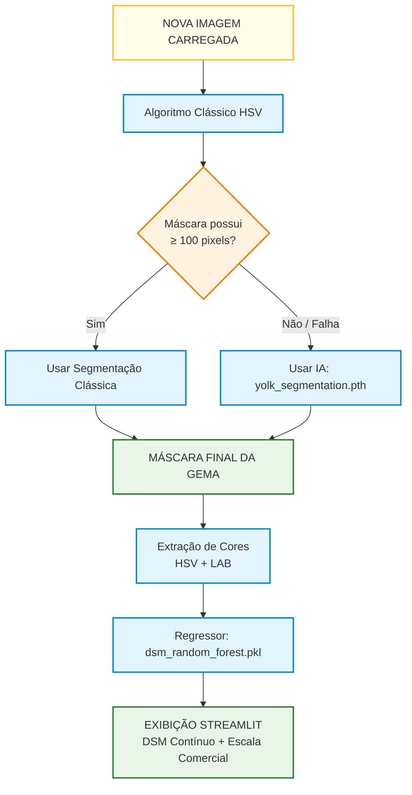

# COLOVO
Sistema Híbrido de Visão Computacional para Classificação de Gemas de OvosO COLOVO é uma plataforma automatizada voltada para a avicultura de precisão e controle de qualidade laboratorial. Seu objetivo principal é mensurar o nível de pigmentação da gema do ovo com base na escala comercial DSM (Digital Yolk Color Fan).
O sistema substitui a avaliação visual humana subjetiva por um pipeline rigoroso de visão computacional e inteligência artificial, combinando processamento digital de imagens clássico, redes neurais convolucionais (U-Net) para segmentação robusta e regressão estatística avançada (Random Forest).

## Objetivos
- *Padronização Industrial*: Eliminar a variação humana na classificação da cor da gema.
- *Segmentação Resiliente*: Isolar a gema com precisão, mesmo sob variações de iluminação, presença de clara ou quebra estrutural.
- *Predição de Alta Precisão*: Estimar o valor contínuo e a classe discreta do leque DSM através do perfil colorimétrico multiespacial (HSV + LAB).

## Arquitetura e Engenharia de Software
O ecossistema do projeto é dividido em três macrossegmentos modulares, descritos abaixo por seus fluxogramas de engenharia.

### Fluxo de Preparação e Treinamento da Segmentação (Auto-Labeling + U-Net)
Para eliminar a necessidade de anotação manual exaustiva de milhares de imagens, o COLOVO utiliza uma estratégia de *Auto-Labeling*. O algoritmo clássico baseado em limiarização HSV gera as primeiras máscaras-alvo ideais, que servem de gabarito estruturado para treinar uma rede profunda U-Net. A rede neural aprende a generalizar e corrigir imperfeições onde o algoritmo clássico falharia.



### Fluxo de Treinamento do Modelo DSM (Random Forest)
Uma vez isolada a região exata da gema pelo modelo binário de segmentação, o pipeline executa uma extração estatística rigorosa das propriedades físicas de cor (medianas e desvios padrões nos canais HSV e LAB). Esses vetores numéricos alimentam um regressor *Random Forest*, validado estatisticamente para mapear as nuances cromáticas no espectro DSM.



### Uso do Sistema em Produção (Inference Pipeline Híbrido)
Em tempo de execução, o COLOVO adota uma abordagem de *tolerância a falhas* (_fallback_ automático). O sistema prioriza a velocidade computacional do processamento clássico HSV. Se o número de pixels válidos detectados for inferior a 100 (indicando falha crítica de leitura, reflexo excessivo ou oclusão), o pipeline invoca de forma transparente o modelo de IA U-Net para garantir que a gema seja perfeitamente isolada.



## Instalação em um ambiente local
Sequência de passos para a instalação local do colovo usando um ambiente virtual:
```bash
# Baixar o código fonte
git clone https://github.com/glenjasper/colovo.git
cd colovo

# Criação de um ambiente virtual
python -m venv env_colovo

# Ativação do ambiente virtual
source env_colovo/bin/activate

# Instalação das bibliotecas python
pip install -r requirements.txt

# Instalação local do colovo
pip install -e .
```
> *Nota*: O código baixado já contém os modelos treinados (models/dsm_random_forest.pkl e models/yolk_segmentation.pth), basta executar o script _app/streamlit_app.py_.

## Como Usar
### Executando a Interface Web (Streamlit)
Para rodar a aplicação interativa de análise unitária em tempo real, execute o comando:
```bash
streamlit run app/streamlit_app.py
```

## Passos de Treinamento e Reprodução
Se desejar reconfigurar, atualizar os pesos da IA ou treinar novamente o estimador estatístico do zero, execute a sequência abaixo:

### 1. Geração automática de máscaras (Auto-Labeling):
```bash
python scripts/generate_masks.py
```
### 2. Divisão do dataset de segmentação:
```bash
python scripts/split_dataset.py
```
### 3. Treinamento da Rede Neural U-Net:
```bash
python scripts/train_segmentation.py
```
### 4. Extração de features colorimétricas e treino do modelo DSM:
```bash
python scripts/train_dsm.py
```
