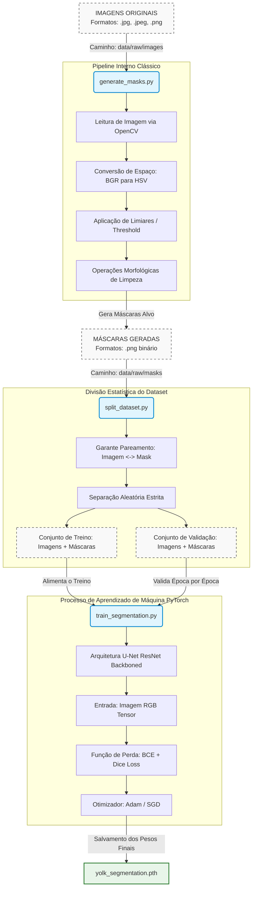
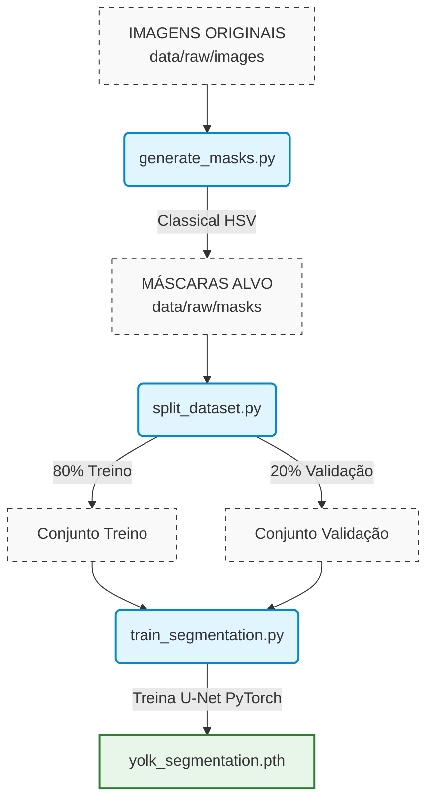
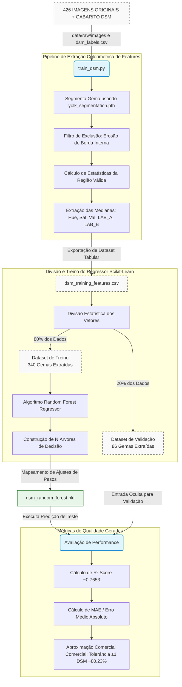
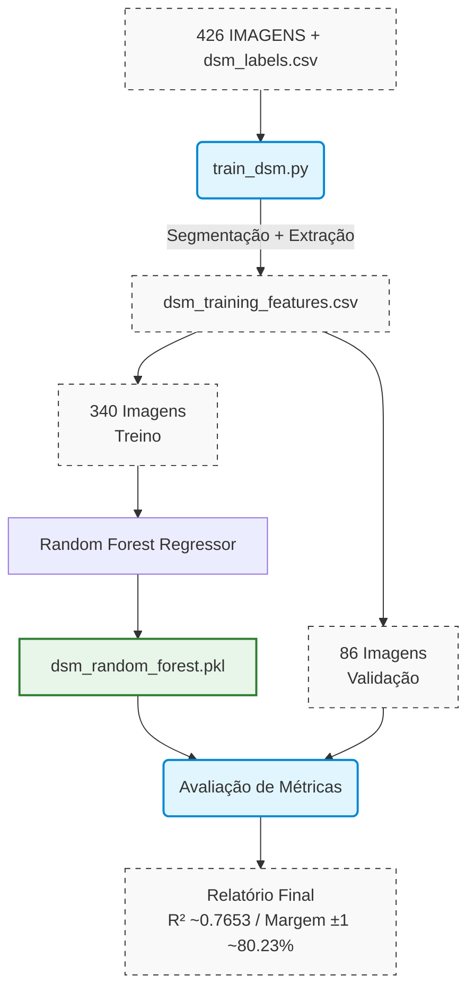
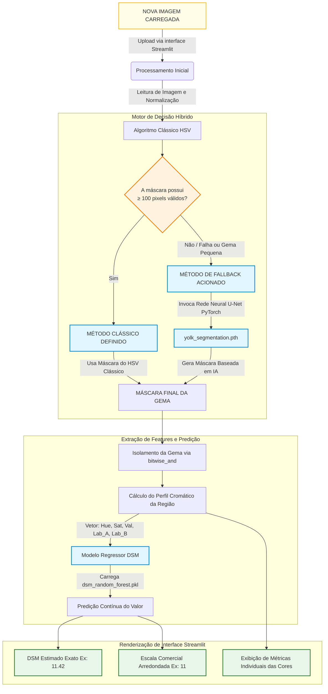
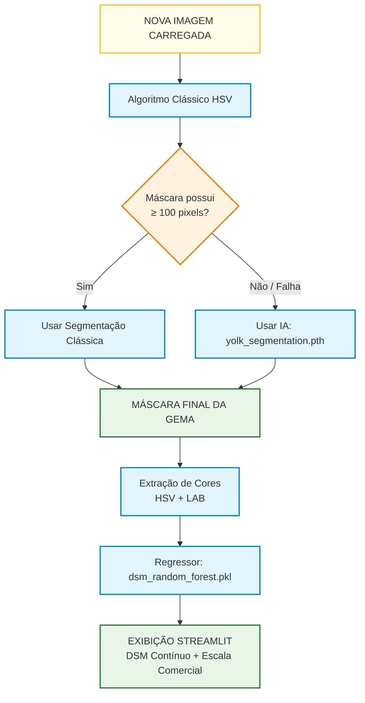

# colovo

## Fluxo de Preparação e Treinamento da Segmentação (Auto-Labeling + U-Net)
Este diagrama detalha o processo desde as imagens brutas em formato de câmera até a exportação do arquivo binário de pesos da rede neural PyTorch.

## Fluxo de Treinamento do Modelo DSM (Random Forest)
Este diagrama detalha como as 426 imagens passam pela extração colorimétrica para treinar o estimador estatístico, incluindo a divisão exata observada nos seus relatórios de validação.

## Uso do Sistema em Produção (Inference Pipeline Híbrido)
Este diagrama documenta a arquitetura de execução em tempo real do aplicativo Streamlit, detalhando o comportamento lógico do algoritmo de contingência (_fallback_).

